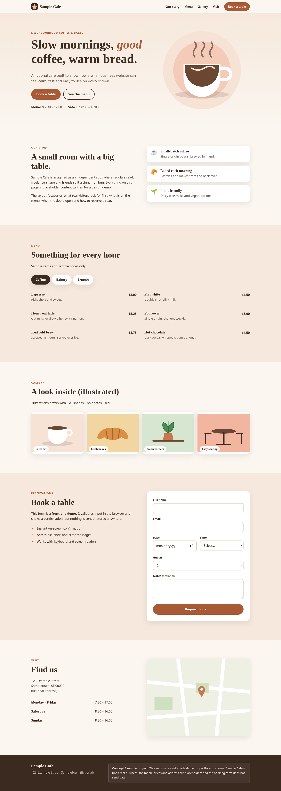


# Sample Cafe – Responsive Business Website (Concept)

> **Concept / sample project.** A self-made demo for portfolio purposes. "Sample Cafe" is a fictional business – it is **not client work**. All text, prices, hours and the address are placeholders, and the booking form does not send or store any data.

## What it is
A responsive multi-section website for a fictional neighbourhood cafe: hero, story, tabbed menu, illustrated gallery, booking form UI, opening hours / location and footer.

## Tech
- Semantic **HTML5**
- Hand-written **CSS** (custom properties, Grid, Flexbox, `clamp()` fluid type, `prefers-reduced-motion`)
- Vanilla **JavaScript** (no dependencies, no build step)
- All imagery is inline **SVG** – no photos, no third-party assets or fonts

## Features
- Mobile-first responsive layout with a collapsible navigation
- Accessible tabbed menu (arrow-key / Home / End support, ARIA roles)
- Booking form UI with client-side validation, inline error messages and an on-screen confirmation (**front-end only**)
- Skip link, visible focus styles, sufficient colour contrast, one `h1`, landmark regions
- Lighthouse-style practices: meta description, theme colour, favicon, no render-blocking JS (`defer`), no external requests, small page weight

## Run locally
```bash
python3 -m http.server 8000   # or open index.html directly
```
Then visit http://localhost:8000.

## Screenshots
| Desktop | Mobile |
|---|---|
|  |  |

## Honest note
This is a sample built to demonstrate my web development workflow. It contains no real brand, testimonials, metrics or client data.
